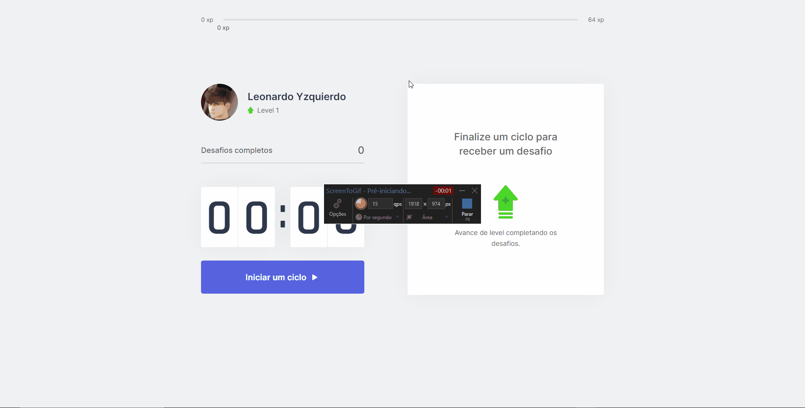

<h1>𝗡𝗟𝗪 𝟰 (𝗥𝗲𝗮𝗰𝘁𝗝𝗦)</h1>
<p>🔎About: Application made to help you stay healthy while working/developing.</p>

<div align="center">
  <a href="#technologies">Technologies</a>&nbsp;&nbsp;&nbsp;|&nbsp;&nbsp;&nbsp;
  <a href="#how-to-use">How To Use</a>
</div>

<h2>🔧 Features</h2>

- [x] Leveling system
- [x] Challenges teaching how to perform stretches
- [x] Countdown using pomodoro technique
- [x] Data storage in cookies

<h2>👀 𝗣𝗿𝗲𝘃𝗶𝗲𝘄</h2>


<h2 id="technologies">⚙️ 𝗧𝗲𝗰𝗵𝗻𝗼𝗹𝗼𝗴𝗶𝗲𝘀</h2>

<ul>
  <li>ReactJS</li>
  <li>Typescript</li>
  <li>NextJS</li>
  <li>Styled components</li>
  <li>React icons</li>
</ul>

<h2 id="how-to-use">📌 𝗛𝗼𝘄 𝗧𝗼 𝗨𝘀𝗲</h2>

```bash
# Clone this repository
$ git clone https://github.com/LeonardoYz/Moveit-1.0.git

# Go into the repository
$ cd Moveit-1.0

# Install dependencies
$ yarn install

# Run the application
$ yarn dev
```